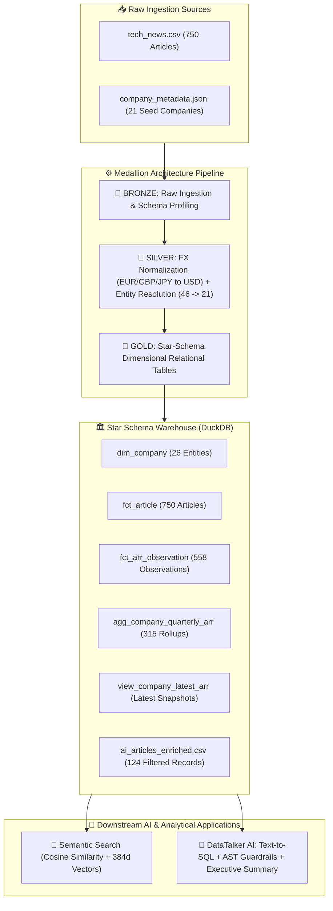

# 📰 Tech News & ARR Analytical Data Platform

[](https://github.com/chanakyachandu/tech-news-arr-warehouse/actions/workflows/ci.yml)
[](https://www.python.org/)
[](DATA_ARCHITECTURE.md)
[](DATA_ARCHITECTURE.md)
[](tests/test_pipeline.py)
[](notebooks/04_sql_queries.ipynb)

An end-to-end data platform implementing the **Medallion Architecture**
(`Bronze` ──► `Silver` ──► `Gold`) for tech news ingestion, company entity resolution,
multi-currency ARR normalization, dimensional star-schema modeling, and an interactive
**Natural Language to SQL Assistant** ("DataTalker AI") with AST safety guardrails.



---

## 📁 Repository Structure

```
tech-news-arr-warehouse/
├── medallion/                         # ⚙️ Core Medallion Architecture Python Package
│   ├── __init__.py                    # Exposes pipeline APIs
│   ├── bronze.py                      # Bronze layer: Ingestion & schema validation
│   ├── silver.py                      # Silver layer: Cleaning, entity resolution & enrichment
│   └── gold.py                        # Gold layer: Star schema modeling, rollups & exports
│
├── notebooks/                         # 📓 Interactive Walkthrough & Demonstration Notebooks
│   ├── 01_bronze.ipynb                # Ingestion & raw data profiling
│   ├── 02_silver.ipynb                # Cleaning, FX normalization & entity resolution
│   ├── 03_gold.ipynb                  # Relational star schema warehouse & aggregations
│   ├── 04_sql_queries.ipynb           # SQL analytics (DuckDB & SQLite) over warehouse tables
│   └── 05_ai_text_to_sql.ipynb        # 🤖 Interactive AI Text-to-SQL Assistant Walkthrough
│
├── ai_text_to_sql/                    # 🤖 Natural Language to SQL Assistant Package
│   ├── __init__.py
│   ├── schema_provider.py             # DuckDB loader & dynamic schema prompt extractor
│   ├── sql_guard.py                   # Read-Only AST validator, command blocker & limit injector
│   ├── sql_generator.py               # Gemini AI SQL generator & executive result explainer
│   └── cli.py                         # Interactive terminal loop
│
├── tests/                             # 🧪 Automated Test Suite (pytest)
│   ├── __init__.py
│   └── test_pipeline.py               # Data quality, FX math, table grain & referential integrity
│
├── advanced_semantic_search/          # 🤖 Advanced Vector Search & Embeddings Module
│   ├── semantic_search.ipynb          # Cosine similarity, vector search & hybrid filtering
│   ├── README.md                      # Semantic search documentation
│   └── data/embeddings/               # Pre-computed dense vector matrix (.npy)
│
├── pipeline.py                        # 🚀 End-to-end batch CLI pipeline orchestrator
├── text_to_sql.py                     # 💬 Interactive Text-to-SQL conversational agent launcher
├── DATA_ARCHITECTURE.md               # Dimensional star schema specifications & governance
├── README.md                          # Documentation and portfolio guide
├── Task.txt                           # Project specification document
├── requirements.txt                   # Pinned Python dependencies
├── .gitignore                         # Git exclusion rules for clean commits
│
└── data/                              # 💾 Data Storage
    ├── raw/                           # Source CSVs & canonical metadata
    │   ├── tech_news.csv              # 750 raw tech articles
    │   └── company_metadata.json      # 21 seed companies metadata
    ├── processed/                     # Cleaned Silver dataset
    │   └── tech_news_clean.csv        # Cleaned, standardized articles
    └── warehouse/                     # Gold relational warehouse tables & deliverables
        ├── dim_company.csv            # Company dimension (N = 26)
        ├── fct_article.csv            # Article fact table (N = 750)
        ├── fct_arr_observation.csv    # ARR point-in-time observations (N = 558)
        ├── agg_company_quarterly_arr.csv # Quarterly rollups (N = 315)
        ├── view_company_latest_arr.csv   # Latest ARR snapshot per company (N = 26)
        └── ai_articles_enriched.csv   # Downstream AI deliverable (N = 124)
```

---

## 🌊 End-to-End Pipeline Flow & Data Lifecycle

Here is how data flows through the platform from raw source files to analytical and AI consumption:

```
[ RAW SOURCES ]
  • data/raw/tech_news.csv (750 raw tech articles)
  • data/raw/company_metadata.json (21 seed companies)
       │
       ▼
[ 1. BRONZE LAYER: Raw Ingestion ]
  • Script: medallion/bronze.py (Notebook: 01_bronze.ipynb)
  • Actions: Zero mutations, schema validation, baseline profiling
       │
       ▼
[ 2. SILVER LAYER: Cleaning & Normalization ]
  • Script: medallion/silver.py (Notebook: 02_silver.ipynb)
  • Actions: Multi-currency FX to USD (EUR, GBP, JPY, range midpoints)
             Company alias resolution (46 -> 21 canonical entities)
             Category taxonomy mapping (19 -> 7 clean categories)
             Date standardization & feature engineering (age, size)
  • Output:  data/processed/tech_news_clean.csv
       │
       ▼
[ 3. GOLD LAYER: Dimensional Star Schema ]
  • Script: medallion/gold.py (Notebook: 03_gold.ipynb)
  • Tables:  dim_company (N = 26)
             fct_article (N = 750)
             fct_arr_observation (N = 558)
             agg_company_quarterly_arr (N = 315)
             view_company_latest_arr (N = 26)
             ai_articles_enriched.csv (N = 124)
       │
       ▼
[ 4. BATCH PIPELINE ORCHESTRATION ]
  • Script:  pipeline.py
  • Actions: Executes Bronze -> Silver -> Gold in-memory, logs timings
  • Outputs: Materializes all 7 CSVs to data/processed/ & data/warehouse/
       │
       ▼
[ 5. AUTOMATED QUALITY TESTING (CI/CD) ]
  • Script:  pytest tests/test_pipeline.py
  • Actions: 12 automated unit & integration tests validate FX math,
             range midpoints, table grains, and referential integrity
       │
       ▼
[ 6. ANALYTICAL SQL EXPLORATION ]
  • Script:  notebooks/04_sql_queries.ipynb (DuckDB & SQLite engines)
  • Actions: Window functions, QoQ ARR growth metrics, company rankings
       │
       ▼
[ 7. DOWNSTREAM AI & SEMANTIC SEARCH ]
  • Module:  advanced_semantic_search/ (semantic_search.ipynb)
  • Actions: 384-dim dense embeddings, cosine similarity search,
             hybrid SQL metadata + vector distance filtering
       │
       ▼
[ 8. NATURAL LANGUAGE TO SQL ASSISTANT ("DATATALKER AI") ]
  • Module:  ai_text_to_sql/ (Launcher: text_to_sql.py)
  • Actions: AST safety guard, self-correcting Gemini SQL generation,
             dynamic schema prompt injection, 2-sentence summaries
```

### 1. Bronze Stage (Raw Ingestion)
* **Code**: [`medallion/bronze.py`](medallion/bronze.py) |
  **Notebook**: [`01_bronze.ipynb`](notebooks/01_bronze.ipynb)
* **Inputs**: Raw CSVs in `data/raw/*.csv` (currently `tech_news.csv`, 750 rows) plus
  `data/raw/company_metadata.json` (21 companies).
* **Process**:
  * **Multi-File Batch Ingestion**: Uses `glob('*.csv')` + `pd.concat` to merge raw CSVs,
    auto-excluding warehouse exports.
  * **Deduplication**: Runs `drop_duplicates(subset=['article_id'])` to guarantee zero
    duplicate articles on re-runs.
  * **JSON Flattener**: Converts `company_metadata.json` into a clean tabular DataFrame
    (`orient='index'`).
  * **DataFrame Outputs**: Returns `(df_articles_raw, df_companies_raw)` directly to Silver
    with zero destructive mutations.

### 2. Silver Stage (Cleaning, Canonicalization & Feature Engineering)
* **Code**: [`medallion/silver.py`](medallion/silver.py) |
  **Notebook**: [`02_silver.ipynb`](notebooks/02_silver.ipynb)
* **Inputs**: Raw DataFrames `(df_articles_raw, df_companies_raw)` from Bronze.
* **Process**:
  * **Entity & Category Canonicalization**: `COMPANY_NAME_MAPPING` maps 46 aliases to 21
    entities (flagging unmapped with `has_company_metadata`); `CATEGORY_MAPPING` maps
    19 raw tags to 7 clean taxonomy values.
  * **Multi-Currency FX & Range Parser**: `extract_currency()` detects currency symbols
    (£, €, ¥, $), `parse_revenue()` calculates midpoints on ranges, and `FX_RATES_TO_USD`
    normalizes values into integer USD (`revenue_usd_M`).
  * **Temporal Standardization**: `pd.to_datetime(format='mixed', dayfirst=False, utc=True)`
    formats dates to `dd-mm-yyyy` and derives temporal features (`published_year`, `quarter`,
    `month`, `year_month`).
  * **Feature Engineering & Enrichment**: `pd.merge` joins company metadata; derives
    `company_age` (`published_year - founded_year`) and `assign_size_category()` bins
    employee counts (`Small`, `Medium`, `Large`).
  * **Pipeline Orchestration**: `clean_articles_pipeline()` handles cleaning, deterministic
    sorting, and export via `run_silver()` to `data/processed/tech_news_clean.csv`.
* **Output**: `data/processed/tech_news_clean.csv` (Clean, fully enriched tabular dataset).

### 3. Gold Stage (Dimensional Star Schema & Exports)
* **Code**: [`medallion/gold.py`](medallion/gold.py) |
  **Notebook**: [`03_gold.ipynb`](notebooks/03_gold.ipynb)
* **Inputs**: Clean Silver dataset (`tech_news_clean.csv`).
* **Process**:
  * **Deterministic Surrogate Keys**: `generate_company_id_map()` builds alphanumeric
    primary keys (`COMP001`, ...) over sorted canonical names; `build_fct_arr_observation()`
    assigns `ARR0001` keys.
  * **Star Schema Modeling**: `build_dim_company()` aggregates metadata per company (26 rows);
    `build_fct_article()` maps foreign key `company_id` and retains 750 article records.
  * **Financial Fact Isolation**: `build_fct_arr_observation()` filters `revenue_usd_M.notnull()`
    to isolate point-in-time revenue observations (558 rows) with standard `arr_usd` values.
  * **Aggregations & Analytical Views**: `build_agg_company_quarterly_arr()` computes quarterly
    rollups (`count`, `avg`, `min`, `max`, `latest`); `build_view_company_latest_arr()`
    extracts the latest known ARR per company.
  * **Deliverable & Warehouse Export**: `build_ai_articles_enriched()` filters AI/ML records
    (2022-2024, ARR > $50M) for downstream AI; `build_and_export_warehouse()` exports all 6
    relational CSVs to `data/warehouse/`.
* **Output**: Exported relational CSVs in `data/warehouse/` ready for SQL & BI querying.

### 4. Pipeline Orchestration Layer (Batch Execution)
* **Code**: [`pipeline.py`](pipeline.py)
* **Inputs**: Raw sources in `data/raw/` via Bronze ingestion.
* **Process**:
  * **Unified In-Memory Streaming**: Executes `get_raw_data()`, streaming DataFrames directly
    into `clean_articles_pipeline()` with zero intermediate disk persistence.
  * **Transformation to Model Handoff**: Streams enriched Silver DataFrame directly into
    `build_and_export_warehouse()`, maintaining strict data lineage.
  * **Latency & Execution Telemetry**: Benchmarks stage execution durations via `time.time()`
    and logs progress (`[1/3] Bronze`, `[2/3] Silver`, `[3/3] Gold`).
  * **Atomic Materialization**: Guarantees all 7 deliverable CSVs are materialized into
    `data/processed/` and `data/warehouse/` atomically.
* **Output**: Fully materialized warehouse ready for downstream SQL analytics and AI agents.

### 5. Automated Quality Testing Layer
* **Code**: [`tests/test_pipeline.py`](tests/test_pipeline.py) | **Suite**: `pytest`
* **Inputs**: Output datasets from Bronze, Silver, and Gold stages.
* **Process**:
  * **Data Parsing & FX Math**: `test_currency_extraction()`, `test_revenue_parsing_formats()`,
    `test_revenue_range_midpoint()`, and `test_fx_conversion_rates()` verify precision.
  * **Categorization & Resolution**: `test_company_alias_resolution()`,
    `test_category_taxonomy_mapping()`, and `test_company_size_categorization()` assert rules.
  * **Warehouse Grains & Integrity**: `test_dim_company_grain()` (26 companies),
    `test_fct_arr_observation_integrity()` (558 valid records), and `test_referential_integrity()`
    assert foreign key relationships with zero orphan records.
  * **Deliverable Compliance**: `test_ai_articles_enriched_criteria()` guarantees 100% adherence
    to Task Section 3 filtering rules (AI/ML industry/category, 2022-2024, ARR > $50M).
* **Output**: 12/12 passing unit and integration tests confirming pipeline integrity.

### 6. Analytical SQL Exploration Layer
* **Notebook**: [`04_sql_queries.ipynb`](notebooks/04_sql_queries.ipynb)
* **Inputs**: Modeled warehouse tables (`dim_company.csv`, `fct_article.csv`,
  `fct_arr_observation.csv`).
* **Process**:
  * **Zero-Copy In-Memory Engines**: Mounts warehouse CSVs directly in DuckDB and SQLite without
    duplicating physical storage.
  * **Window Functions & Rankings**: Executes ANSI SQL using `ROW_NUMBER() OVER (PARTITION BY ...)`
    to rank top-revenue companies and calculate market share across industries.
  * **Quarterly Growth & Lag Metrics**: Calculates quarter-over-quarter ARR growth trends using
    `LAG(arr_usd_M) OVER (PARTITION BY company_id ORDER BY observation_year, observation_quarter)`.
  * **Cross-Dimensional Rollups**: Performs multi-table joins across `fct_arr_observation` and
    `dim_company` to aggregate ARR observations by company size and public status.
* **Output**: Verified analytical query results, financial trend tables, and ranking dataframes.

### 7. Downstream AI & Semantic Search Layer
* **Code**: [`advanced_semantic_search/`](advanced_semantic_search) |
  **Notebook**: [`semantic_search.ipynb`](advanced_semantic_search/semantic_search.ipynb)
* **Inputs**: `data/warehouse/ai_articles_enriched.csv` (124 filtered AI/ML records, ARR > $50M).
* **Process**:
  * **Dense Vector Embeddings**: Encodes combined text (`title + summary`) into 384-dimensional
    embeddings using pre-computed sentence transformer representations (`article_embeddings.npy`).
  * **Cosine Similarity & Recommendation**: `top_similar_articles()` computes pairwise cosine
    distances between articles to generate nearest-neighbor content recommendations.
  * **Semantic Vector Retrieval**: `find_similar_articles()` performs nearest-neighbor vector
    search over free-form user query strings.
  * **SQL + Vector Hybrid Filter**: `hybrid_search()` merges relational metadata filters (company,
    date, ARR threshold) with vector similarity distances to produce targeted search results.
* **Output**: Ranked semantic search outputs, article recommendations, and high-dimensional vectors.

### 8. Natural Language to SQL Assistant Layer ("DataTalker AI")
* **Code**: [`ai_text_to_sql/`](ai_text_to_sql) |
  **Launcher**: [`text_to_sql.py`](text_to_sql.py) |
  **Notebook**: [`05_ai_text_to_sql.ipynb`](notebooks/05_ai_text_to_sql.ipynb)
* **Inputs**: 5 warehouse tables in `data/warehouse/` (`dim_company`, `fct_article`,
  `fct_arr_observation`, `agg_company_quarterly_arr`, `view_company_latest_arr`).
* **Architecture & Component Mechanics**:
  * **1. Schema Provider ([`schema_provider.py`](ai_text_to_sql/schema_provider.py))**:
    `init_duckdb_warehouse()` loads warehouse CSVs into in-memory DuckDB tables.
    `get_warehouse_schema_context()` inspects columns, data types, foreign keys, and real sample
    rows to construct an LLM-grounded schema prompt with business query rules.
  * **2. Production SQL Safety Guard ([`sql_guard.py`](ai_text_to_sql/sql_guard.py))**:
    `clean_sql_query()` strips markdown blocks and semicolons. `validate_sql_safety()` blocks 16
    destructive keywords (`DROP`, `DELETE`, `UPDATE`, `INSERT`, `ALTER`, `TRUNCATE`, `EXEC`),
    enforces `SELECT`/`WITH` only, and `enforce_row_limit()` auto-injects `LIMIT 50`.
  * **3. AI SQL Generator ([`sql_generator.py`](ai_text_to_sql/sql_generator.py))**:
    `get_gemini_client()` connects to Gemini API (`gemini-3.5-flash-lite` via OpenAI SDK).
    `generate_sql()` translates natural language questions into ANSI DuckDB SQL.
    `execute_and_retry_sql()` runs the query; on syntax or schema errors, it automatically feeds
    the error back to Gemini for self-correction (up to 2 retries).
  * **4. Executive Result Explainer ([`sql_generator.py`](ai_text_to_sql/sql_generator.py))**:
    `explain_query_results()` feeds tabular query results back to Gemini to synthesize a concise,
    2-sentence executive summary directly answering the business question in plain English.
  * **5. Interactive REPL Terminal ([`cli.py`](ai_text_to_sql/cli.py))**:
    `run_cli()` provides an interactive terminal loop (`python text_to_sql.py`) where users chat
    with the warehouse in real time with formatted tabular results and execution metrics.
* **Output**: Validated ANSI DuckDB SQL, tabular query outputs, and 2-sentence executive answers.

---

## 🚀 1. System Requirements & Installation

### Requirements
* **Python**: 3.9+ (Tested on Python 3.11, 3.12 & 3.13)
* **OS**: Windows, macOS, Linux
* **Memory**: Minimum 4GB RAM

### Installation
Clone the repository and install dependencies:
```bash
git clone https://github.com/chanakyachandu/tech-news-arr-warehouse.git
cd tech-news-arr-warehouse

# Virtual environment setup
python -m venv .venv

# Windows:
.venv\Scripts\activate

# macOS / Linux:
source .venv/bin/activate

pip install -r requirements.txt
```

---

## ⚡ 2. How to Run the Pipeline

### Option A: Run the End-to-End Batch Pipeline
Execute the full Medallion pipeline from raw ingestion through Gold warehouse export:
```bash
python pipeline.py
```

### Option B: Run Individual Medallion Stages
Each medallion stage can also be executed independently as a standalone module:
```bash
python -m medallion.bronze   # Run Bronze raw ingestion
python -m medallion.silver   # Run Silver cleaning & export tech_news_clean.csv
python -m medallion.gold     # Run Gold dimensional modeling & exports
```

### Option C: Launch the Interactive AI Text-to-SQL Assistant
Chat directly with the modeled warehouse dataset using plain English:
```bash
python text_to_sql.py
```

---

## 🧪 3. Running Automated Tests

A comprehensive `pytest` test suite validates currency parsing, range midpoints, category
taxonomies, star schema grains, and referential integrity:

```bash
pytest tests/ -v
```

Output:
```text
tests/test_pipeline.py::test_currency_extraction PASSED
tests/test_pipeline.py::test_revenue_parsing_formats PASSED
tests/test_pipeline.py::test_revenue_range_midpoint PASSED
tests/test_pipeline.py::test_fx_conversion_rates PASSED
tests/test_pipeline.py::test_company_size_categorization PASSED
tests/test_pipeline.py::test_category_taxonomy_mapping PASSED
tests/test_pipeline.py::test_company_alias_resolution PASSED
tests/test_pipeline.py::test_silver_structure PASSED
tests/test_pipeline.py::test_dim_company_grain PASSED
tests/test_pipeline.py::test_referential_integrity PASSED
tests/test_pipeline.py::test_fct_arr_observation_integrity PASSED
tests/test_pipeline.py::test_ai_articles_enriched_criteria PASSED
============================= 12 passed in 0.65s ==============================
```

---

## 🏛️ 4. Data Architecture & Documentation

For full architectural designs, dimensional star schema specifications, surrogate key
rationale, and cloud scaling patterns:
* See **[DATA_ARCHITECTURE.md](DATA_ARCHITECTURE.md)** for warehouse modeling & governance.
* See **[Task.txt](Task.txt)** for original client requirements and specifications.
* See **[05_ai_text_to_sql.ipynb](notebooks/05_ai_text_to_sql.ipynb)** for interactive AI demo.
