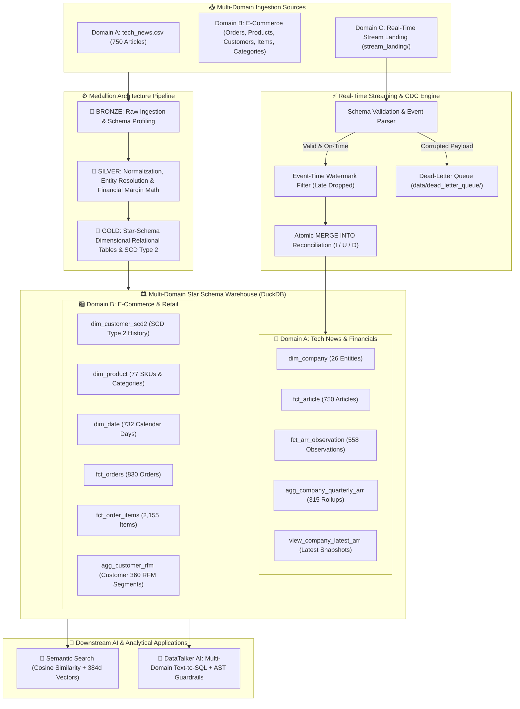

# 📰 Tech News & Multi-Domain Analytical Lakehouse Platform

[](https://github.com/chanakyachandu/tech-news-arr-warehouse/actions/workflows/ci.yml)
[](https://www.python.org/)
[](DATA_ARCHITECTURE.md)
[](DATA_ARCHITECTURE.md)
[](tests/)
[](notebooks/04_sql_queries.ipynb)

An enterprise-grade multi-domain data platform implementing **Dual-Mode Batch Medallion Architecture**
(`Bronze` ──► `Silver` ──► `Gold`), **Slowly Changing Dimensions (SCD Type 2)**, and **Real-Time Streaming CDC Engine** (Event-Time Watermarking,
Dead-Letter Queue `DLQ`, and atomic `MERGE INTO` reconciliation) across two core enterprise domains:
1. **Domain A (Tech News & Financial ARR)**: Articles, company entity resolution, ARR observations, and Natural Language to SQL Assistant ("DataTalker AI").
2. **Domain B (E-Commerce & Omnichannel Retail)**: Relational orders, fulfillment tracking, line-item margins, customer loyalty tier SCD Type 2 history, and Customer 360 RFM segmentation.



---

## 📁 Repository Structure

```
tech-news-arr-warehouse/
├── medallion/                         # ⚙️ Core Medallion Architecture Python Package
│   ├── __init__.py                    # Exposes pipeline APIs
│   ├── bronze.py                      # Bronze layer: Tech news raw ingestion
│   ├── silver.py                      # Silver layer: Tech news cleaning & normalization
│   ├── gold.py                        # Gold layer: Tech news star schema modeling
│   ├── streaming_cdc.py               # ⚡ Real-time Streaming, Watermarking & CDC MERGE
│   └── ecommerce_medallion.py         # 🛍️ E-Commerce Medallion, SCD Type 2 & RFM Analytics
│
├── notebooks/                         # 📓 Interactive Walkthrough & Demonstration Notebooks
│   ├── 01_bronze.ipynb                # Ingestion & raw data profiling
│   ├── 02_silver.ipynb                # Cleaning, FX normalization & entity resolution
│   ├── 03_gold.ipynb                  # Relational star schema warehouse & aggregations
│   ├── 04_sql_queries.ipynb           # SQL analytics (DuckDB & SQLite) over warehouse tables
│   ├── 05_ai_text_to_sql.ipynb        # 🤖 Interactive AI Text-to-SQL Assistant Walkthrough
│   ├── 06_realtime_cdc_streaming.ipynb# ⚡ Real-Time Streaming & CDC Reconciliation Walkthrough
│   └── 07_ecommerce_lakehouse_scd2.ipynb # 🛍️ E-Commerce Lakehouse, SCD Type 2 & RFM Walkthrough
│
├── ai_text_to_sql/                    # 🤖 Natural Language to SQL Assistant Package
│   ├── __init__.py
│   ├── schema_provider.py             # DuckDB loader & dynamic schema prompt extractor
│   ├── sql_guard.py                   # Read-Only AST validator, command blocker & limit injector
│   ├── sql_generator.py               # Gemini AI SQL generator & executive result explainer
│   └── cli.py                         # Interactive terminal loop
│
├── tests/                             # 🧪 Automated Test Suite (pytest - 22 Tests)
│   ├── __init__.py
│   ├── test_pipeline.py               # Tech news data quality & star schema integrity (12 Tests)
│   ├── test_streaming_cdc.py          # Streaming, Watermark, DLQ & CDC reconciliation (5 Tests)
│   └── test_ecommerce.py              # E-Commerce Bronze, Silver math, SCD 2 & RFM tests (5 Tests)
│
├── advanced_semantic_search/          # 🤖 Advanced Vector Search & Embeddings Module
│   ├── semantic_search.ipynb          # Cosine similarity, vector search & hybrid filtering
│   ├── README.md                      # Semantic search documentation
│   └── data/embeddings/               # Pre-computed dense vector matrix (.npy)
│
├── pipeline.py                        # 🚀 Multi-domain master CLI orchestrator
├── text_to_sql.py                     # 💬 Interactive Text-to-SQL conversational agent launcher
├── DATA_ARCHITECTURE.md               # Dimensional star schema specifications & governance
├── README.md                          # Master documentation and portfolio guide
├── Task.txt                           # Project specification document
├── requirements.txt                   # Pinned Python dependencies
├── .gitignore                         # Git exclusion rules for clean commits
│
└── data/                              # 💾 Data Storage
    ├── raw/                           # Raw datasets
    │   ├── tech_news.csv              # Domain A: 750 raw tech articles
    │   ├── company_metadata.json      # Domain A: 21 seed companies metadata
    │   └── ecommerce/                 # 🛍️ Domain B: 5 relational E-Commerce CSVs
    ├── processed/                     # Cleaned Silver datasets (Articles & E-Commerce)
    ├── stream_landing/                # ⚡ Real-time JSON micro-batch landing zone
    ├── dead_letter_queue/             # ⚡ Quarantined corrupt event records (DLQ)
    └── warehouse/                     # Gold relational warehouse tables
        ├── dim_company.csv            # Company dimension (N = 26)
        ├── fct_article.csv            # Article fact table (N = 750)
        ├── fct_arr_observation.csv    # ARR observations (N = 558)
        └── ecommerce/                 # 🛍️ E-Commerce Star Schema & SCD 2 Tables
            ├── dim_customer_scd2.csv  # Customer SCD Type 2 history (N = 175)
            ├── dim_product.csv        # Product dimension (N = 77)
            ├── dim_date.csv           # Date hierarchy (N = 732)
            ├── fct_orders.csv         # Order transactional facts (N = 830)
            ├── fct_order_items.csv    # Line-item facts (N = 2,155)
            └── agg_customer_rfm.csv   # Customer 360 RFM segmentation (N = 89)
```

---

## 🌊 End-to-End Pipeline Flow & Data Lifecycle

Here is how data flows through the multi-domain platform from raw source files and real-time streams to analytical and AI consumption:

```
[ 📥 RAW INGESTION SOURCES ]
  • Domain A: data/raw/tech_news.csv (750 articles), company_metadata.json (21 seed companies)
  • Domain B: data/raw/ecommerce/ (customers.csv, products.csv, categories.csv, orders.csv, order_details.csv)
  • Domain C: data/stream_landing/ (Real-time JSONL event batches)
        │
        ▼
[ 1. BRONZE LAYER: Raw Ingestion & Profiling ]
  • Scripts:   medallion/bronze.py & medallion/ecommerce_medallion.py (Notebooks: 01_bronze, 07_ecommerce)
  • Actions:   Zero-mutation ingestion, structural schema validation, metadata profiling
        │
        ▼
[ 2. SILVER LAYER: Cleaning, Normalization & Feature Engineering ]
  • Scripts:   medallion/silver.py & medallion/ecommerce_medallion.py (Notebooks: 02_silver, 07_ecommerce)
  • Actions:   Domain A: FX normalization to USD (EUR, GBP, JPY, ranges), company alias resolution (46 -> 21), category taxonomy mapping (19 -> 7)
               Domain B: ISO datetime conversion, fulfillment latency duration, gross/discount/net line calculations
               Domain C: Payload validation, Dead-Letter Queue (DLQ) routing, event-time watermarking
  • Outputs:   data/processed/tech_news_clean.csv & data/processed/ecommerce/ (silver_customers, silver_products, silver_orders, silver_order_items)
        │
        ▼
[ 3. GOLD LAYER: Multi-Domain Star Schema & SCD Type 2 Models ]
  • Scripts:   medallion/gold.py, medallion/ecommerce_medallion.py & medallion/streaming_cdc.py
  • Tables:    Domain A: dim_company (N=26), fct_article (N=750), fct_arr_observation (N=558), agg_company_quarterly_arr (N=315), view_company_latest_arr (N=26)
               Domain B: dim_customer_scd2 (N=175), dim_product (N=77), dim_date (N=732), fct_orders (N=830), fct_order_items (N=2,155), agg_customer_rfm (N=89)
               Deliverable: ai_articles_enriched.csv (N=124)
        │
        ▼
[ 4. REAL-TIME STREAMING & CDC RECONCILIATION ENGINE ]
  • Script:    medallion/streaming_cdc.py (Notebook: 06_realtime_cdc_streaming.ipynb)
  • Actions:   Event-time watermarking (48h cutoff), DLQ error isolation, atomic MERGE INTO reconciliation (I/U/D)
        │
        ▼
[ 5. MULTI-DOMAIN PIPELINE ORCHESTRATION ]
  • Script:    pipeline.py (CLI flag: --streaming)
  • Actions:   Executes all domains end-to-end in-memory in ~0.56 seconds with full telemetry
        │
        ▼
[ 6. AUTOMATED QUALITY TESTING (CI/CD) ]
  • Suite:     pytest tests/ (22 Passing Tests)
  • Actions:   Validates FX precision, star schema grains, SCD 2 active flags, watermarking, DLQ, and referential integrity
        │
        ▼
[ 7. ANALYTICAL SQL EXPLORATION (DUCKDB & SQLITE) ]
  • Notebooks: notebooks/04_sql_queries.ipynb & notebooks/07_ecommerce_lakehouse_scd2.ipynb
  • Actions:   Window ranking, QoQ ARR growth, market basket analysis, customer RFM cohort segmentation
        │
        ▼
[ 8. DOWNSTREAM AI & SEMANTIC SEARCH ]
  • Module:    advanced_semantic_search/ (semantic_search.ipynb)
  • Actions:   384-dimensional dense vector embeddings, cosine similarity search, hybrid metadata filtering
        │
        ▼
[ 9. NATURAL LANGUAGE TO SQL ASSISTANT ("DATATALKER AI") ]
  • Module:    ai_text_to_sql/ (Launcher: text_to_sql.py)
  • Actions:   AST read-only guardrails, self-correcting Gemini SQL generation, dynamic schema injection, 2-sentence summaries
```

### 1. Bronze Stage (Raw Multi-Domain Ingestion)
* **Code**: [`medallion/bronze.py`](medallion/bronze.py) & [`medallion/ecommerce_medallion.py`](medallion/ecommerce_medallion.py) |
  **Notebooks**: [`01_bronze.ipynb`](notebooks/01_bronze.ipynb) & [`07_ecommerce_lakehouse_scd2.ipynb`](notebooks/07_ecommerce_lakehouse_scd2.ipynb)
* **Inputs**: Raw CSVs in `data/raw/*.csv` (`tech_news.csv`, `company_metadata.json`) and `data/raw/ecommerce/*.csv` (`customers`, `products`, `categories`, `orders`, `order_details`).
* **Process**:
  * **Multi-File Batch Ingestion**: Ingests raw structured CSVs and flattens nested JSON metadata without schema mutation.
  * **Deduplication**: Enforces `drop_duplicates()` across natural primary keys to guarantee idempotent re-runs.
  * **Zero-Loss Provenance**: Passes clean DataFrames to Silver preserving source lineage.

### 2. Silver Stage (Cleaning, Canonicalization & Feature Engineering)
* **Code**: [`medallion/silver.py`](medallion/silver.py) & [`medallion/ecommerce_medallion.py`](medallion/ecommerce_medallion.py) |
  **Notebooks**: [`02_silver.ipynb`](notebooks/02_silver.ipynb) & [`07_ecommerce_lakehouse_scd2.ipynb`](notebooks/07_ecommerce_lakehouse_scd2.ipynb)
* **Process**:
  * **Domain A (Tech News)**: `COMPANY_NAME_MAPPING` resolves 46 aliases to 21 canonical entities; `CATEGORY_MAPPING` maps 19 raw tags to 7 clean taxonomies; `FX_RATES_TO_USD` converts EUR, GBP, JPY and revenue ranges to normalized USD integers (`revenue_usd_M`).
  * **Domain B (E-Commerce)**: Standardizes ISO order/shipping timestamps; calculates fulfillment duration (`fulfillment_days`); computes line-item financial formulas (`line_gross_amount`, `discount_amount`, `line_net_amount`); denormalizes product category metadata and stock health statuses.
* **Outputs**: `data/processed/tech_news_clean.csv` and `data/processed/ecommerce/` silver tables.

### 3. Gold Stage (Multi-Domain Star Schema & SCD Type 2)
* **Code**: [`medallion/gold.py`](medallion/gold.py) & [`medallion/ecommerce_medallion.py`](medallion/ecommerce_medallion.py) |
  **Notebooks**: [`03_gold.ipynb`](notebooks/03_gold.ipynb) & [`07_ecommerce_lakehouse_scd2.ipynb`](notebooks/07_ecommerce_lakehouse_scd2.ipynb)
* **Process**:
  * **Deterministic Surrogate Keys**: Assigns surrogate alphanumeric keys (`COMP001`, `CUST_SK_0001`, `PROD_SK_001`, `ITEM_SK_00001`).
  * **Slowly Changing Dimension Type 2 (`dim_customer_scd2`)**: Tracks customer loyalty tier progressions (Bronze &rarr; Silver &rarr; Gold &rarr; Platinum) and credit limit adjustments with `effective_start_date`, `effective_end_date`, and `is_current_flag`.
  * **Star Schema Facts**: Builds `fct_article`, `fct_arr_observation`, `fct_orders`, and `fct_order_items`.
  * **Customer 360 RFM Analytics (`agg_customer_rfm`)**: Pre-computes Recency, Frequency, and Monetary scores, assigning customers to behavioral cohorts (*Champions*, *Loyal Customers*, *At Risk*, *Lost*).
* **Outputs**: Exported relational CSVs in `data/warehouse/` and `data/warehouse/ecommerce/`.

### 4. Real-Time Streaming & CDC Layer
* **Code**: [`medallion/streaming_cdc.py`](medallion/streaming_cdc.py) |
  **Notebook**: [`06_realtime_cdc_streaming.ipynb`](notebooks/06_realtime_cdc_streaming.ipynb)
* **Process**:
  * **Event-Time Watermarking**: Evaluates incoming events against a 48-hour watermark window, discarding late arrivals.
  * **Dead-Letter Queue (DLQ)**: Quarantines corrupted or malformed payloads into `data/dead_letter_queue/` with error metadata.
  * **Atomic `MERGE INTO` CDC Reconciliation**: Reconciles live `INSERT`, `UPDATE`, and `DELETE` op-codes directly into Gold tables.

### 5. Multi-Domain Pipeline Orchestration
* **Code**: [`pipeline.py`](pipeline.py)
* **Process**:
  * Executes all domains end-to-end in-memory via `python pipeline.py --streaming` with stage latency telemetry in **~0.56 seconds**.

### 6. Automated Quality Testing Layer
* **Code**: [`tests/`](tests/) | **Runner**: `pytest`
* **Coverage**: **22 passing tests** asserting FX math, range midpoints, table grains, SCD 2 active flags, watermarking cutoff, and zero orphan foreign keys.

### 7. Analytical SQL Exploration Layer
* **Notebooks**: [`04_sql_queries.ipynb`](notebooks/04_sql_queries.ipynb) & [`07_ecommerce_lakehouse_scd2.ipynb`](notebooks/07_ecommerce_lakehouse_scd2.ipynb)
* **Process**:
  * Zero-copy in-memory DuckDB queries for window rankings, quarter-over-quarter ARR growth, product category margins, and market basket affinity.

### 8. Downstream AI & Semantic Search Layer
* **Code**: [`advanced_semantic_search/`](advanced_semantic_search) |
  **Notebook**: [`semantic_search.ipynb`](advanced_semantic_search/semantic_search.ipynb)
* **Process**:
  * 384-dimensional dense sentence embeddings (`article_embeddings.npy`) for cosine similarity search and hybrid SQL metadata filtering.

### 9. Natural Language to SQL Assistant Layer ("DataTalker AI")
* **Code**: [`ai_text_to_sql/`](ai_text_to_sql) |
  **Launcher**: [`text_to_sql.py`](text_to_sql.py) |
  **Notebook**: [`05_ai_text_to_sql.ipynb`](notebooks/05_ai_text_to_sql.ipynb)
* **Components**:
  * **Schema Provider**: Dynamically inspects tables, types, foreign keys, and sample rows.
  * **AST Safety Guard**: Blocks 16 destructive keywords and injects row limits.
  * **AI SQL Generator & Self-Correction**: Translates English questions into DuckDB SQL with auto-retries on error.
  * **Executive Explainer**: Synthesizes tabular results into 2-sentence plain English executive briefs.

---

## 🚀 1. System Requirements & Installation

### Requirements
* **Python**: 3.9+ (Tested on Python 3.11, 3.12 & 3.13)
* **OS**: Windows, macOS, Linux
* **Memory**: Minimum 4GB RAM

### Installation
Clone the repository and install dependencies:
```bash
git clone https://github.com/chanakyachandu/tech-news-arr-warehouse.git
cd tech-news-arr-warehouse

# Virtual environment setup
python -m venv .venv

# Windows:
.venv\Scripts\activate

# macOS / Linux:
source .venv/bin/activate

pip install -r requirements.txt
```

---

## ⚡ 2. How to Run the Pipeline

### Option A: Run the End-to-End Batch Pipeline
Execute the full Medallion pipeline from raw ingestion through Gold warehouse export:
```bash
python pipeline.py
```

### Option B: Run Individual Medallion Stages
Each medallion stage can also be executed independently as a standalone module:
```bash
python -m medallion.bronze   # Run Bronze raw ingestion
python -m medallion.silver   # Run Silver cleaning & export tech_news_clean.csv
python -m medallion.gold     # Run Gold dimensional modeling & exports
```

### Option C: Launch the Interactive AI Text-to-SQL Assistant
Chat directly with the modeled warehouse dataset using plain English:
```bash
python text_to_sql.py
```

---

## 🧪 3. Running Automated Tests

A comprehensive `pytest` test suite validates currency parsing, range midpoints, category
taxonomies, star schema grains, and referential integrity:

```bash
pytest tests/ -v
```

Output:
```text
tests/test_pipeline.py::test_currency_extraction PASSED
tests/test_pipeline.py::test_revenue_parsing_formats PASSED
tests/test_pipeline.py::test_revenue_range_midpoint PASSED
tests/test_pipeline.py::test_fx_conversion_rates PASSED
tests/test_pipeline.py::test_company_size_categorization PASSED
tests/test_pipeline.py::test_category_taxonomy_mapping PASSED
tests/test_pipeline.py::test_company_alias_resolution PASSED
tests/test_pipeline.py::test_silver_structure PASSED
tests/test_pipeline.py::test_dim_company_grain PASSED
tests/test_pipeline.py::test_referential_integrity PASSED
tests/test_pipeline.py::test_fct_arr_observation_integrity PASSED
tests/test_pipeline.py::test_ai_articles_enriched_criteria PASSED
============================= 12 passed in 0.65s ==============================
```

---

## 🏛️ 4. Data Architecture & Documentation

For full architectural designs, dimensional star schema specifications, surrogate key
rationale, and cloud scaling patterns:
* See **[DATA_ARCHITECTURE.md](DATA_ARCHITECTURE.md)** for warehouse modeling & governance.
* See **[Task.txt](Task.txt)** for original client requirements and specifications.
* See **[05_ai_text_to_sql.ipynb](notebooks/05_ai_text_to_sql.ipynb)** for interactive AI demo.
